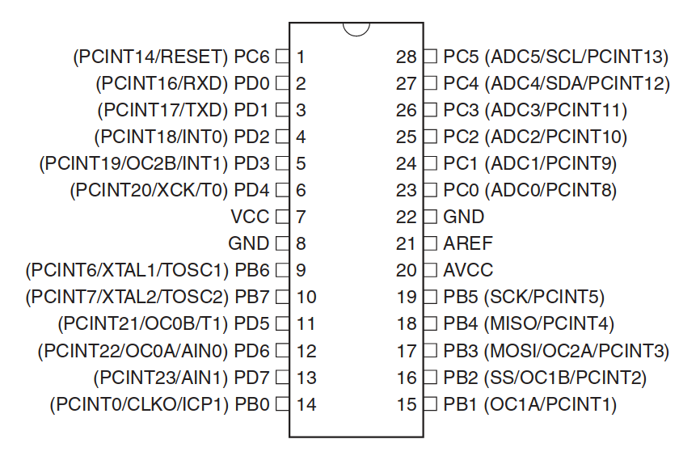
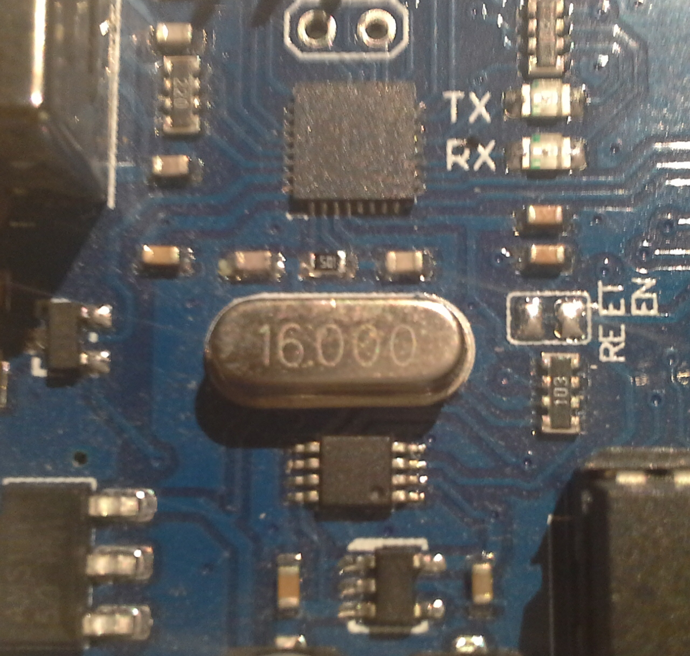

The Arduino language has made it really simple to create “sketches” or programs which perform a directive. You may argue that the Arduino language is somewhat difficult as it is a C/C++ hybrid but I’d personally disagree. The language is fairly high level and uses predefined functions that don’t get in your way. But what if you wanted to program a AVR microcontroller more “down to the metal”? Then AVR libc is a good option. 

<hr>

*Please note that I am not an AVR libc expert in any shape, way, or form. I am actually learning while writing this tutorial from the aspect of someone who has been programming with Arduino already, but wanted to progress and understand the lower-level aspect of these microcontrollers.*

# Why would I ever want to use AVR libraries?{md-permalink=""}

AVR libc is very useful because of the massive amount of support for devices, portability, speed and decreased RAM and flash ROM usage. This means you can have more functionality in a smaller space or faster amount of operations. Or maybe you just want to learn the lower-level method of programming AVR chips (which is the category I fall into).

# What are AVR microcontrollers?{md-permalink=""}

*Skip to the third paragraph if you are already familiar with the term...*

Microcontrollers, if you did not know already, are, in layman’s terms, a computer on a chip. The chip has an Arithmetic Logic Unit for numerical and logic operations (as the name implies), Electronic Erasable Programmable Read Only Memory (a.k.a. EEPROM) to save data more permanently, Random Access Memory to store data temporarily usually as variables, data buses and more. It’s not a computer capable of running a modern operating system of course, since most microcontrollers don’t have a flash memory (for storing programs) even over 1 megabyte or a clock speed of more than a few megahertz. However, they are great for electronics projects and use digital and analogue signals to interface with the real world.

AVR microcontrollers on the other hand, are normally 8-bit controllers in the AVR family. These are based on the RISC (Reduced instruction set computing) architecture, which is simply a method of reducing the work done by a microcontroller while performing the same operations. AVRs are produced by Atmel and include many features such as Serial and I2C. These microcontrollers are programmed via an ISP (in-system programmer) but that’s usually handled by your board of choice (unless you make your own of course). A serial connection to your computer allows it to send program data to the controller and flash its ROM. But I digress... AVR Libc is a programming code used to interact with electrical components and that’s what I’ll cover in this tutorial.

Microcontrollers have pins and ports. Ports are very important for AVR libc programming. You can identify the ports on a microcontroller from its datasheet. Here’s an example from the ATmega328 (AVR chip commonly found on Arduino UNO boards) datasheet:

{md-lightbox=""}

You can identify a port from this diagram from the name of the pin to the left. Pin 1 has a name of `PC6`{class="inline"} which is:

```
P // Pin
C // port C
6 // Sixth pin in port
```

This means that pin 19 (`PB5`{class="inline"}) is the fifth pin on Port B.

Each port is assigned two 8-bit binary numbers. One for direction, the other for output. For example, Port D has two global variables, PORTD and DDRD. Let’s say that both PORTD and DDRD have values of `00000000`{class="inline"}.

Before we can go over the syntax, I must first talk about an important aspect of AVR programming...

# C Bitwise Operations{md-permalink=""}

Bitwise operations are operations just like arithmetic in C, but with binary digits (See this tutorial on binary if you are not familiar). Here are the operations you can do to binary digits in C:

## AND{md-permalink=""}

This is represented with one ampersand `&`{class="inline"} and is just like AND in logic...

{md-lightbox=""}

An AND operation requires two binary numbers, and this comparison is made between all of the numbers of the same position.

### Example{md-permalink=""}

Say we have two binary numbers: `01100001`{class="inline"} and `01001001`{class="inline"}. An AND operation performed between these numbers is as follows...

```
  01100001
& 01001001
----------
  01000001
```

As you can see, an AND operation is completed on each column of digits, just like a truth table.
`0 & 0 == 0` `1 & 1 == 1` `1 & 0 == 0` etc.

## OR{md-permalink=""}

This is represented with a pipe `|`{class="inline"} symbol and functions like an OR gate...

{md-lightbox=""}

Just like AND, an OR operation requires a comparison between two binary numbers and it is done in the same way as AND, except each binary digit is put through an OR comparison.

### Example{md-permalink=""}

We have two binary numbers: `01010011`{class="inline"} and `01100010`{class="inline"}. This is how an OR comparison between these numbers would be made:

```
  01010011
| 01100010
----------
  01110011
```

OR operations work very similarly to AND, however also output a 1 when only one of the inputs is HIGH:
`0 | 0 == 0` `0 | 1 == 1` `1 | 1 == 1`

However, these ORs are not exclusive, therefore they output a 1 when both inputs are on.

## XOR{md-permalink=""}

XORs basically perform just like OR operations, except they output a 0 when both inputs are on, therefore making them e(X)clusive. In C, they are represented with a caret `^`{class="inline"} symbol.

{md-lightbox=""}

Everything is just like OR, except the output is 0 if both digits are the same:


### Example{md-permalink=""}

In this example, we have two binary numbers as usual: `01001100`{class="inline"} and `11101001`{class="inline"}. An XOR operation would take place like this:

```
  01001100
^ 11101001
----------
  10100101
```

It’s not necessary to describe how XOR operations work, as it’s just OR, but when both digits are the same, it outputs 0.

## Left Shift{md-permalink=""}

Shifts are a little different from regular logic operations. These move binary numbers a specific number of places either left or right. 

**Mention that _BV() is a better way of using left bitshift in AVR**

## Right Shift{md-permalink=""}

## NOT{md-permalink=""}

## Assignment Operators{md-permalink=""}

Just like for arithmetic, logic has assignment operators. An assignment operator calculates the result and then assigns it to the variable. For example, for addition, an assignment operator looks like this:

`i += 5`

...and for subtraction

`i -= 5` etc.

Bitwise operators also have these. They are just the same operator with a equals sign at the end. For example:

```c
i &= a;  // AND assignment
i |= a;  // OR assignment
i ^= a;  // XOR assignment
i >>= a; // Right Shift assignment
i <<= a; // Left Shift assignment
```

## How is this useful?{md-permalink=""}

Bitwise operations are important in AVR libc programming because it is the basis of digital I/O for the microcontroller. For example, to set a pin to be HIGH you would run a bitwise OR operation between the port and the pin, where the pin is left shifted.

# Digital I/O{md-permalink=""}

One nice thing about using AVR libc is that it is very easy to toggle a pin on or off with XOR assignment.

# Delays{md-permalink=""}

# Note{md-permalink=""}

When writing programs in AVR, it will throw an error (will it?) saying that you have to define F_CPU which is your microcontroller’s clock speed.

# Example Blink Program{md-permalink=""}

```c
#ifndef F_CPU
#define F_CPU 16000000UL
#endif

#include <avr/io.h>
#include <util/delay.h>

#define LED_PIN PORTD5
#define LED_DIR DDD5

void blinkLoop(void) {
  PORTD |= _BV(LED_PIN);
  _delay_ms(1000);
  PORTD &= ~_BV(LED_PIN);
  _delay_ms(1000);
}

int main(void) {
  DDRD |= _BV(LED_DIR);
  while(1)
    blinkLoop();
}
```

### Walk-through{md-permalink=""}

```c
#ifndef F_CPU
#define F_CPU 16000000UL
#endif
```

The global variable `F_CPU`{class="inline"} is important during compilation. It basically gives the compiler an idea of how fast the processor is on the microcontroller. In this case, the ATMEGA328P uses a clock speed of 16Mhz or 16000000 Hz, the `F_CPU`{class="inline"} variable stores the amount of hertz the processor has.

A good way of identifying the speed of a microcontroller, is identifying the crystal on the board. Most crystals have a number on them, which identify the clock speed, in MHz.

{md-lightbox=""}

Another way of knowing a microcontroller’s clock speed is in its datasheet.

One important note is that you have to 

```c
#include <avr/io.h>
#include <util/delay.h>
```

These are the necessary include headers for this file. `<avr/io.h>`{class="inline"} is used for digital I/O (global variables for DD\*, PORT\*, etc.) and `<util/delay.h>`{class="inline"} provides `_delay_ms()`{class="inline"} and `_delay_us()`{class="inline"}, which are delay functions for AVR Libc (milliseconds and microseconds). These functions are not recommended in most cases as it halts the entire microcontroller, but for blinking LEDs, it’s perfectly adequate.

```c
#define LED_PIN PORTD5
#define LED_DIR DDD5
```

These are user-defined global variables which help to understand the program a little bit better. `LED_PIN`{class="inline"} is assigned to `PORTD5`{class="inline"} which is a variable that sets the output of Port D, Pin 5 which is pin 11 as seen in the first diagram. `LED_DIR`{class="inline"}, on the other hand, stores the direction of the pin, whether it is an input or an output.

```c
void blinkLoop(void) {
  PORTD |= _BV(LED_PIN);
  _delay_ms(1000);
  PORTD &= ~_BV(LED_PIN);
  _delay_ms(1000);
}
```

This is a user-defined function which turns the pin on and off once, with a delay of one second. 

## Makefile for Arduino UNO boards

```makefile
F_CPU=16000000UL
BOARD=atmega328p
FILE=blink
BAUDRATE=115200
ACMPORT=/dev/ttyACM0

all: compile

compile:
	avr-gcc -g -Os -mmcu=$(BOARD) -c $(FILE).c
	avr-gcc -g -mmcu=atmega8 -o $(FILE).elf $(FILE).o
	avr-objcopy -j .text -j .data -O ihex $(FILE).elf $(FILE).hex

upload:
	avrdude -v -p $(BOARD) -C /home/kzer-za/.platformio/packages/tool-avrdude/avrdude.conf -c arduino -b $(BAUDRATE) -P $(ACMPORT) -D -U flash:w:./$(FILE).hex:i

clean:
	rm *.o *.elf *.hex 
```

*Diagrams on this blog post have been made in draw.io (except the first one of course)*

**There are probably many mistakes in this article since I am not an AVR expert. Please either [email me](/#/about#contact) or throw an issue over at Github. Any constructive criticism is highly appreciated!**
