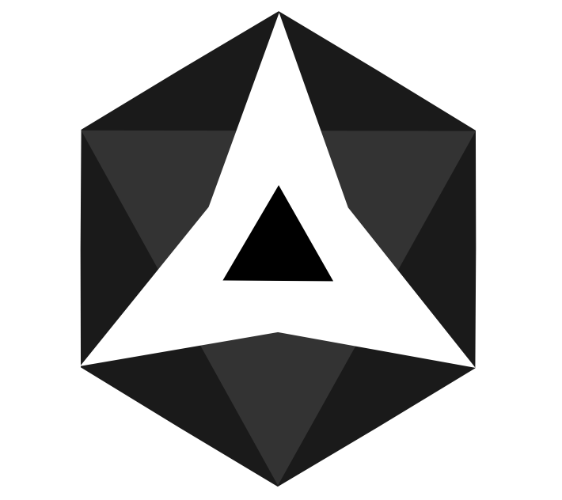
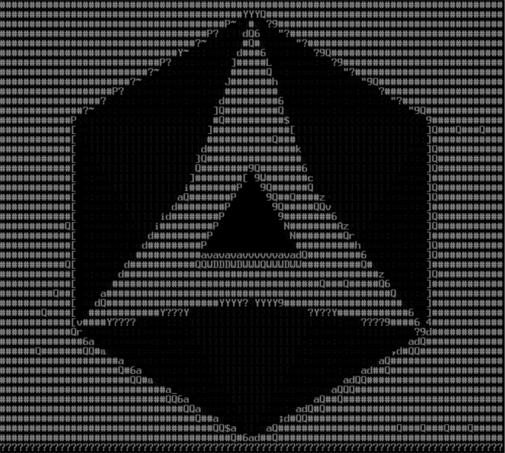
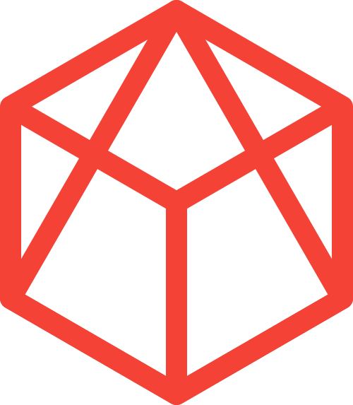
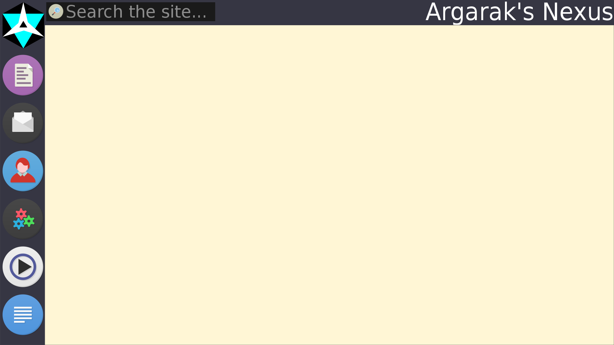
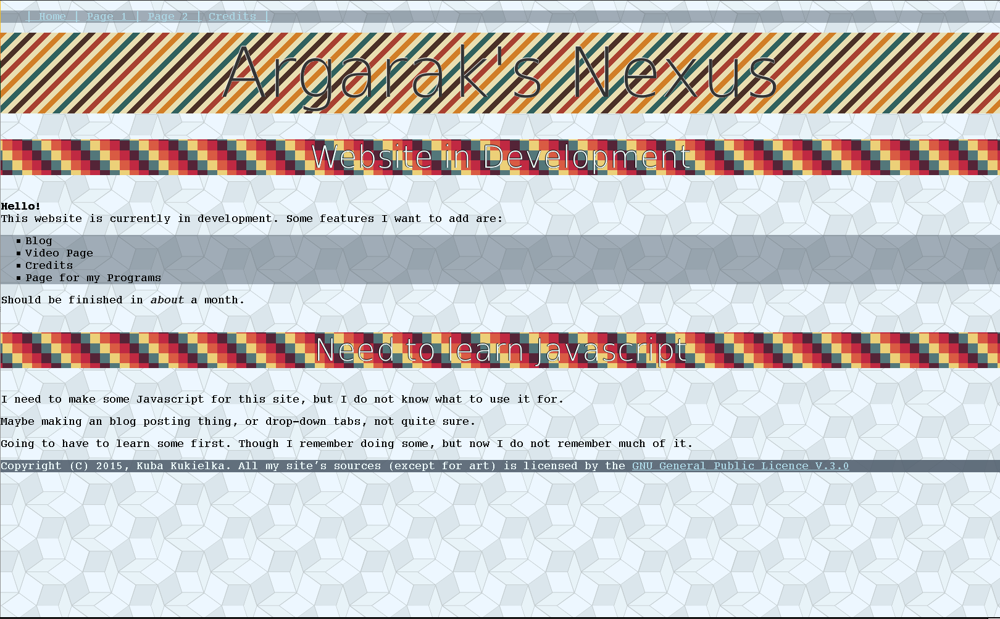
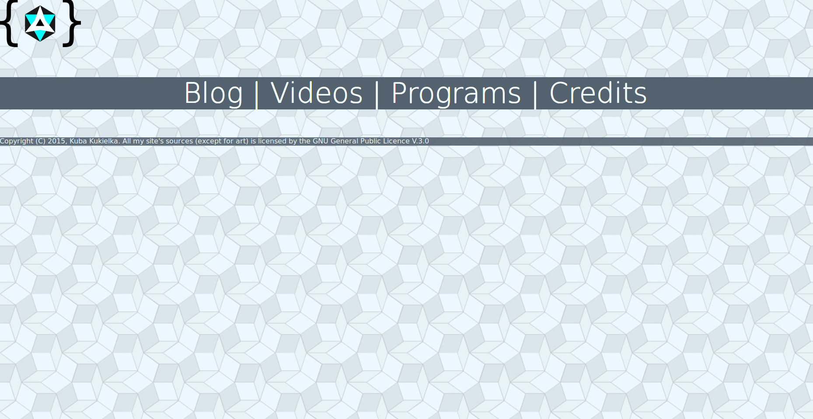
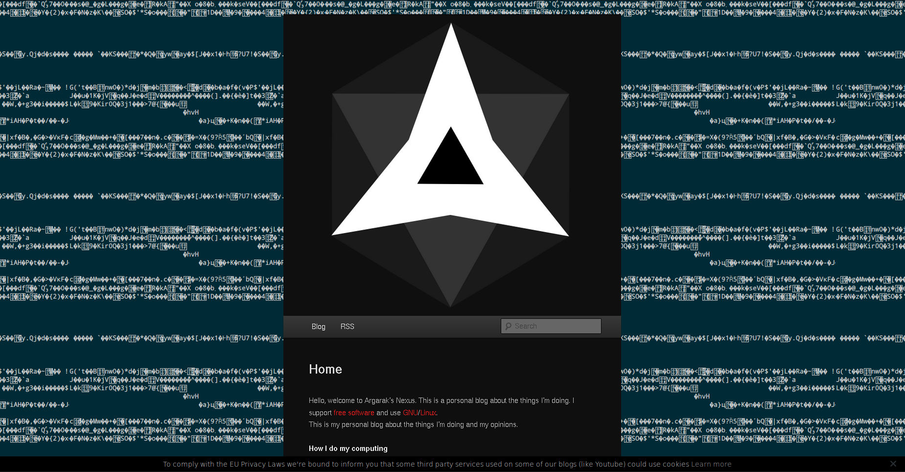
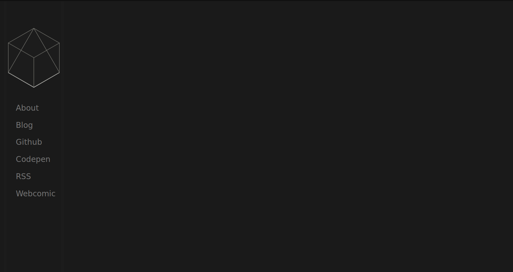
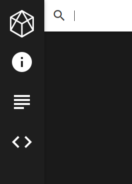

Argarak's Nexus has drastically evolved in a short period (approximately one year). Let's take a look back at what Argarak's Nexus was.

**NOTE: This was written before version 3 of this website! Some information may be invalid to the current version.**

## The name

I took the name Argarak as an alias because it is a ship captain name of the Ilwrath species in the game Star Control 2, which is one of my favourite games of all time. (Though Heroes of Might and Magic III is the best)

Nexus was just a word which I picked out from a thesaurus. After searching the word “network”, I found the word “nexus”, which was appealing to me - even though my website is not a network. (except only in the sense that it is a network of all the rubbish I make, not a literal network).

## The logo

To make a memorable website, you require some sort of logo people will remember the first time they see it. This means that your logo has to be somewhat unique to make it stand out. I guess this is more important to some organisation than some blog but I still wanted something I could be identified by.

Anyway, the first logo I came up with looked like this.

{md-lightbox=""}

Now this is not the first iteration of this logo, the first had a teal background and was slightly thinner (you will see it later on though) but it had the same shape. I chose a hexagon because I like hexagons and the star in the middle with the triangle is meant to represent an “A” for Argarak.

When I made version 1, I later did not use this logo, instead I piped it through an image to ASCII converter and used this logo:

{md-lightbox=""}

This logo was meant to fit in with the background of the website which was also made out of text. This was the most used logo.

After a while, when I started to get fed up of version 1, I wanted a different logo. I was sketching in my notebook fairly often, coming up with new ideas. This one came to my after I drew an isometric grid. I drew some pyramids and but a box around it. The new Nexus logo was made.

{md-lightbox=""}

This is the logo you see now on the side of you screen (or hidden away on mobile).

## Version 0

I always wanted a website of my own. Not really for any particular purpose, other than to put all of my future projects on it. However, there were always difficulties. I did not know HTML or CSS too well, and I did not know any practical JavaScript. Buying a domain name and hosting wasn't too appealing since I did not want to waste money on some website no-one is going to visit. However, I can always make a prototype on my computer!

However, before any real development, I decided to make an image of what I wanted the website to look. I used Inkscape to create the image and it somewhat looks similar - but a lot worse - to what it looks today. So let's take a look at it!

{md-lightbox=""}

Now that's awful design! Post warning, many of these images on this post are going to be quite bad in design. Sorry if it makes you wince. Anyway, As you can see, the desktop sidebar style that version 2 has is present in this image. I've always wanted to make a website with a sidebar for some reason. Frankly, I do not remember fully what those icons meant. I only remember that the top one is the old Nexus logo, the person icon is probably an about page, the gears are most likely some kind of programs repository and the “play” icon is probably about videos or something.

As you will see later, pre-release version 2 had the same top bar. It's interesting how I've kept a similar design over the year.

Finally, development began. Back then, in 2015, I used the Netbeans IDE for my programming needs. It wasn't very good and had many problems. Also, at the time, I used to love this website called [COLOURlovers](http://www.colourlovers.com/), which had collections of various patterns which I used commonly for my websites. Now, they are too colourful and garish for me to use these days, but back then I always liked to use the background-image element on just about all my tags.

So here's how it went!

{md-lightbox=""}

Sadly, I could not find a source of this website, I could have used it as a basis for another, which I will show soon. Anyway, there are many design flaws with the design. The most obvious one would be the inconsistency of the patterns. The website is light coloured, which is not my style any more, the text on the backgrounds is difficult to read and it's too detailed and has no set palette.

All of the links on the top of the page blend in to the background too much, therefore are difficult to see and the font sizes are too large and inconsistent. It's not a great website, to say the least.

As you can read at the bottom of the image, I wanted to learn practical JavaScript however, I did not know jQuery so that's probably why (and yes there are built in ID searching and style setting functions but jQuery is so much easier). *FYI: Version 3 uses Angular and no jQuery*

I believe that this next image is the website that I based this one on. Here's how it looks:

{md-lightbox=""}

At least with this one the links are easy to read. However, they are too large. The whole site is pretty much empty and abandoned.

The logo at the top is the same logo we saw earlier, but this time with curly brackets, for no good reason whatsoever. And I licensed it by the GPL because a ~40 odd line HTML file and a CSS file of approximately the same size should be licensed by a strong copyleft licence, because why not! 

By the way, these are from 2015! I'm amazed the amount of progress I made with my website, it is truly astonishing to see how terrible websites can eventually become good ones. 

~~Actually, at the time, I did not refer to these sites as Argarak's Nexus, the source for the most recent one shown was called "some_website".~~ (Totally false since you see the words “Argarak’s Nexus” on the top of the site!)
 
Of course, I made many little abandoned blogs (i.e [https://argarak.wordpress.com](https://argarak.wordpress.com)) but I will not cover them because they are pretty boring and not very progressive of the Nexus we have today.

 
 
I have been interested in secure and private providers of email, and so I went over to [prism-break](https://prism-break.org/en/) and went over to the Email Accounts section of the site and I found the group Autistici/Inventiati who provided many kinds of services, but my main goal was to finally break away from Google Mail and my spam-filled email account to a safer, private and trustworthy provider. So I signed up, sent them a request and they accepted it, which I was fairy glad about. 

I don't use email often, especially for day-to-day communications, but without it, it would be difficult to contact developers, make accounts and use or subscribe to mailing lists.

Anyway, I heard that A/I were offering a blogging service, which was intriguing, so I set one up. The service was called "Noblogs" and I chose the URL "nexus.noblogs.org". Version 1 has begun.

## Version 1

I never really liked Wordpress myself. It's interface is clunky, customisation is weak (client side) - in the sense that the only thing you can change is the CSS of the website - and server side, it's really confusing for me. The themes are made in PHP for some reason.

I also don't like how you can only create posts with the use of some awful GUI.

However, it is very easy to use and it was the longest running Nexus and with the most posts.

Wordpress also has built in Search and RSS functionality, which makes it even easier to use. (Which is quite a big deal since I always have difficulty implementing search functionality to my sites as you may know)

Here's how the design looked, with the twenty-eleven theme:

{md-lightbox=""}

I tried my best in using the themes that were available on the Noblogs service, since it did not have as many themes as Wordpress.com. So I went with a single column design which did not look too bad. The large logo in the centre was a little frustrating while browsing the website. Since every time you visited a page, you would have to scroll through that large logo. The background of the page is the output from the command `cat /dev/urandom`{class="inline"}.

Later on, I used a Python script to create the background. It simply output ASCII characters, however with no spaces. It meant that there was no longer a seam left from the background tiling. I also improved the navigation bar by changing the gradient to a flat colour (specifically #000), made the text larger and changed the font to Raleway. The logo also changed. I ran it through some kind of image to text library (most likely [aa](https://en.wikipedia.org/wiki/AAlib)) since I liked the idea of having mono-spaced ASCII characters as some sort of style.

Sadly, the website is no longer available at all. And I never thought of archiving it on the Wayback Machine. Oh well. Not like anyone read it at the time. However, if you wish, you may download a copy of the Wordpress exported file which contains all of my previous blog posts. Of course, I'm not going to publish them here since they were not very high quality, to say the least. You may download it [here](https://u.pomf.is/ykuafu.xml).

I never blogged there often. It was running for some time (over 6 months) and only so many posts, I wasn't very frequent and I don't expect to change any time soon. 

## Version 2

I was getting fed up of Wordpress. No markdown support, had to do everything from a browser and most of the time, the website would not even work properly! I had to do something about this, to make my blogging experience better. And so I proceeded to search blogging platforms. Obviously, the first one that I found was Jekyll. To me Jekyll was puzzling. It was simple in the sense that I could just put markdown files in the posts directory. However, the templating engine was confusing and not what I was used to. I made many websites before with HTML (Jade), CSS (Stylus) and Javascript. So making a good looking website was not a problem. What was the problem was that I could not find a good engine that was suitable for someone who simply wanted a way to create templates using HTML and not Javascript and especially not PHP (not that I hate PHP, it's just that I don't know why you would do such a thing)!

However, before any engines, I decided to make a prototype structure for the look and feel of the website. There's the first prototype.

{md-lightbox=""}

The only interesting thing that this site offered was that if you hovered over that thing Nexus logo, the image would fade into the coloured version. I used the [Pure](http://purecss.io/) CSS library for my framework. I only chose it because it had side navigation support.

Another prototype was made, however I will not show it to you because it is even less finished than the prototype I showed you. It's basically the same website however, it has the navigation menu at the bottom. However, I did scrap that idea and continued to stick with the side navigation design.

Anyway, back to engines...

I found Punch. A static site generator which used simple the Mustache template engine. You reference JSON variables with the use of `\{\{brackets\}\}`{class="inline"}, (I had to escape it due to Angular thinking it was a variable) that Punch provides. Now my website is actually based on the [punch-blog](https://github.com/laktek/punch-blog) template which includes helper scripts that read and parse Markdown files in the posts directory. It also includes scripts to manage the Archive and the Blog section of my site.

When I was building the website your on just now, I disliked the example site it came with and scrapped it completely. (It also came with tracking Twitter handles and other social media rubbish I don't use) At the time, I heard of Google's [material design](https://www.google.com/design/spec/material-design/introduction.html) guidelines and the [Materialise CSS](http://materializecss.com/) framework. (Note that my website does not fully meet the requirements as of the time of writing but I hope to achieve that soon) And so I put Materialise on it and stated development. I first made the website myself but I found implementing a proper side navigation menu challenging so I decided to fork the Materialise website and copy the menu from there. But even after that, it was still really hard. I never found a direct example of this on the internet so I had to try myself. I do not remember the exact procedure of making a side navigation menu solely with icons but it certainly took a while. The first website did not have icons on the centre of the screen, instead they were on the top. They were also black and white opposed to the many colours on the icons on the side, which do make the icons stand out. 

{md-lightbox=""}

My old website also had a top search and title bar. The title of the page was on it but it also transformed into a large search menu. (The search did not work of course) I also used the font [Raleway](https://github.com/theleagueof/raleway) for the main text, now I use [Roboto](https://www.google.com/fonts/specimen/Roboto). ~~However, I do still use Raleway on the landing page.~~

Now I can't really and will not document a lot on the technical development of this website as it would take too long and I don't really remember it well. (I also don't keep snapshots of my projects) However, you may see a list of my Github commits right [here](https://github.com/argarak/argarak.github.io/commits/dev).

Well that's it for the history of Argarak's Nexus. Many versions but I finally made one I'm happy with. 

If you were wondering, this is space so that the material box works properly.

