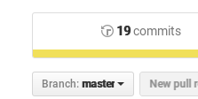
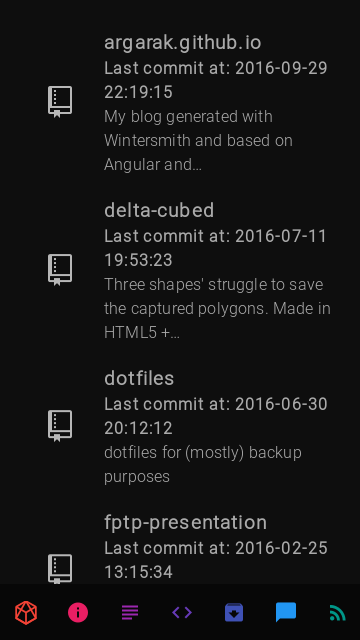
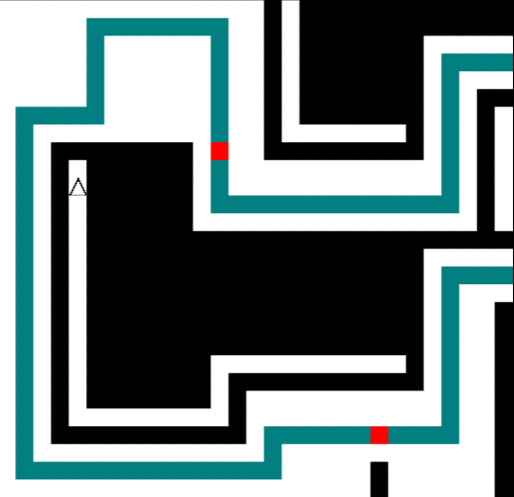
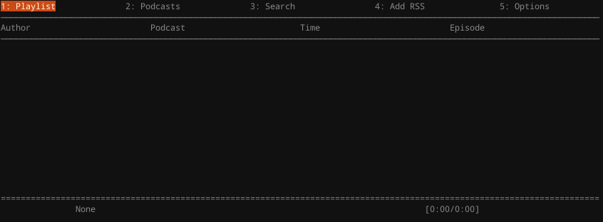

*FYI - Some information is avaliable on the* [about](/#/about) *page. However, this article will elaborate on some of the points made on this page, and include some more information.*

# Projects

First of all, to find the list of all of my repositories, find them at [my repositories page](/#/programs) or my [Github page](https://github.com/argarak?tab=repositories).
I also must elaborate that the word "fork" means to clone someone else's code. Therefore, I have not written all of the code, only modified it a little for my purposes.

Also, since I use a version control system, git, you are able to access all of the changes of every single commit (where you push some changes to a repository). You may find them by clicking on one of the repositories on either of the pages, and then clicking on on "%i commits", where %i is a number. 

{md-lightbox=""}

Here's a list of all of my projects on Github:

{md-lightbox=""}

* [argarak.github.io](https://github.com/argarak/argarak.github.io) is this very page. It is hosted on Github pages, free client-side only hosting (therefore, no PHP or NodeJS scripts running on the server, only HTML, CSS and client-side Javascript). Some of the website's features include:
    * Static-site generation with the use of [Wintersmith](http://wintersmith.io/). This includes [Jade (now known as Pug)](https://pugjs.org/api/getting-started.html) HTML templating (the language compiles into HTML - [see this page's sources here](https://github.com/argarak/argarak.github.io/tree/dev/templates).) Also including the [Stylus](http://stylus-lang.com/) CSS preprocessor (compiles into CSS - [see this page's sources here](https://github.com/argarak/argarak.github.io/blob/dev/contents/css/main.styl).), custom plugins, automatic blog post templating, Jade referenced [header](https://github.com/argarak/argarak.github.io/blob/dev/templates/header.jade) and [footer](https://github.com/argarak/argarak.github.io/blob/dev/templates/footer.jade) pages, automatically generated [RSS](http://www.whatisrss.com/) [feed](/feed.xml), article [JSON](http://json.org/) file - for use in my Angular back-end, which brings me onto...
    * Angular integration. This allows my website to be more interactive. For instance:
        * The redirection of pages without the need to refresh (with the use of [ui-router](https://github.com/angular-ui/ui-router))
        * Search capability on the [blog](/#/blog) page, also including the ability to filter by tag (which also requires the loading of the JSON file which stores all the article data);
        * Pre-loaders on the [repositories](/#/programs) and [microblogging](/#/microblog) pages;
        * Fetching of microblog data from my [pump.io](http://pump.io) provider, currently very inefficient since the data is parsed on a remote server, [feednami](https://sekando.com/docs/feednami), also this is why it is so slow to load;
        * And finally, the list of repositories on my [repositories](/#/programs) page, fetches data from the Github APIs.
      *Also note that I’m using version 1.x of the Angular framework*
    * Use of the [Angular Material](https://material.angularjs.org/latest/) framework. This allows for flexible layouts, many types of elements, theming and colours which all follow the recent [Google Material guidelines](https://material.google.com/). Please note that my website does not fully follow the guidelines and does not intend to do so.
    * If you would like to know some history behind my website, see my article [“The Evolution of Argarak’s Nexus”](/#/articles/nexus-evolution?title=The Evolution of Argarak's Nexus). Do note that some of the information on this page is deprecated.

{md-lightbox=""}

* [Delta-Cubed (Δ³)](http://argarak.github.io/delta-cubed/), [Source](https://github.com/argarak/delta-cubed) (Warning: includes sound!) is a little game experiment I did a long time ago, it’s not complete and probably never will be. Some of the features of the “game” include:
    * Loading map data from CSV files and mapping them to different colours to create a full map ([source](https://github.com/argarak/delta-cubed/blob/master/libraries/loadMap.js)), this is made with the use of the [jsiso](http://jsiso.com/) library;
    * Sound with the use of the [howler.js](https://howlerjs.com/) library, only used for the [background music](https://github.com/argarak/delta-cubed/tree/master/music);
    * And map changing, when the triangle moves to a specific area of the map, another map is loaded.

I did have some ambitions for the game, for example an isometric battle system, other characters and mouse pathfinding, however with the use of the deprecated library jsiso, I became frustrated and left it. If I ever write it again, I’ll use a different engine.

{md-lightbox=""}

* [Podcurse](https://github.com/argarak/podcurse)
