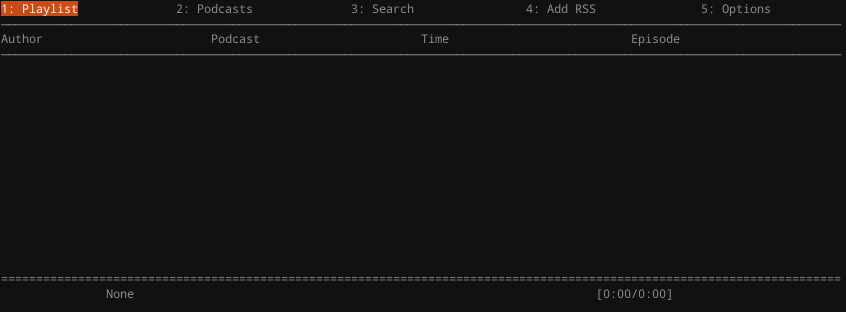

In this article, I will list the projects I have done in the past, my workflow and how I learned to program in the first place.

*FYI - Some information about this may be found on the [about](/#/about) page, however this article will expand on some of the points made on that page, and provide extra information.*

*This site works best on Firefox and Gecko-based browsers, if there is any issue with the browser you are using, please submit an [issue](https://github.com/argarak/argarak.github.io/issues) containing the browser, version, operating system information, a screenshot, a description of the problem and the link to the specific page.*

# Projects

First of all, to find the list of all of my repositories, find them at [my repositories page](/#/programs) or my [Github page](https://github.com/argarak?tab=repositories).
I also must elaborate that the word "fork" means to clone someone else's code. Therefore, I have not written all of the code, only modified it a little for my purposes.

Also, since I use a version control system, git, you are able to access all the changes of every single commit (where you push some changes to a repository). You may find them by clicking on one of the repositories on either of the pages, and then clicking on on “`%i`{class="inline"} commits”, where `%i`{class="inline"} is a number. 

{md-lightbox=""}

Here's a list of all of my projects on Github:

{md-lightbox=""}

* [argarak.github.io](https://github.com/argarak/argarak.github.io) is this very page. It is hosted on Github pages, free client-side only hosting (therefore, no PHP or NodeJS scripts running on the server, only HTML, CSS and client-side Javascript). Some of the website's features include:
    * Static-site generation with the use of [Wintersmith](http://wintersmith.io/). This includes [Jade (now known as Pug)](https://pugjs.org/api/getting-started.html) HTML templating (the language compiles into HTML - [see this page's sources here](https://github.com/argarak/argarak.github.io/tree/dev/templates).) Also including the [Stylus](http://stylus-lang.com/) CSS preprocessor (compiles into CSS - [see this page's sources here](https://github.com/argarak/argarak.github.io/blob/dev/contents/css/main.styl).), custom plugins, automatic blog post templating, Jade referenced [header](https://github.com/argarak/argarak.github.io/blob/dev/templates/header.jade) and [footer](https://github.com/argarak/argarak.github.io/blob/dev/templates/footer.jade) pages, automatically generated [RSS](http://www.whatisrss.com/) [feed](/feed.xml), article [JSON](http://json.org/) file - for use in my Angular back-end, which brings me onto...
    * Angular integration. This allows my website to be more interactive ([Source](https://github.com/argarak/argarak.github.io/blob/dev/contents/js/angularMain.js)). For instance:
        * The redirection of pages without the need to refresh (with the use of [ui-router](https://github.com/angular-ui/ui-router))
        * Search capability on the [blog](/#/blog) page, also including the ability to filter by tag (which also requires the loading of the JSON file which stores all the article data);
        * Pre-loaders on the [repositories](/#/programs) and [microblogging](/#/microblog) pages;
        * Fetching of microblog data from my [pump.io](http://pump.io) provider, currently very inefficient since the data is parsed on a remote server, [feednami](https://sekando.com/docs/feednami), also this is why it is so slow to load;
        * And finally, the list of repositories on my [repositories](/#/programs) page, fetches data from the Github APIs.
        * *Also note that I’m using version 1.x of the Angular framework*
    * Use of the [Angular Material](https://material.angularjs.org/latest/) framework. This allows for flexible layouts, many types of elements, theming and colours which all follow the recent [Google Material guidelines](https://material.google.com/). Please note that my website does not fully follow the guidelines and does not intend to do so.
    * If you would like to know some history behind my website, see my article [“The Evolution of Argarak’s Nexus”](/#/articles/nexus-evolution?title=The Evolution of Argarak's Nexus). Do note that some information on this page is deprecated.
    * FYI - This website is still not finished, there are many problems, especially with the support of various browsers. If any problems occur, please make a new issue at [the issues page](https://github.com/argarak/argarak.github.io/issues).

{md-lightbox=""}

* [Delta-Cubed (Δ³)](http://argarak.github.io/delta-cubed/), [Source](https://github.com/argarak/delta-cubed) (Warning: includes sound!) is a little game experiment I did a long time ago, it’s not complete and probably never will be. Some features of the “game” include:
    * Loading map data from CSV files and mapping them to different colours to create a full map ([source](https://github.com/argarak/delta-cubed/blob/master/libraries/loadMap.js)), this is made with the use of the [jsiso](http://jsiso.com/) library;
    * Sound with the use of the [howler.js](https://howlerjs.com/) library, only used for the [background music](https://github.com/argarak/delta-cubed/tree/master/music);
    * And map changing, when the triangle moves to a specific area of the map, another map is loaded.

I did have some ambitions for the game, for example an isometric battle system, other characters and mouse path finding, however with the use of the deprecated library jsiso, I became frustrated and left it. If I ever write it again, I’ll use a different engine.

{md-lightbox=""}

* [Podcurse](https://github.com/argarak/podcurse) is a completely unfinished application, aiming to be a MPD client for listening to podcasts. There’s not much I can say about it, as I will never work on it again, eventually I’ll remove it from my repositories.

*Could not provide an image since this is neither a graphical or console application*

* [miscr](https://github.com/argarak/miscr) is my attempt at writing a [stepper motor](https://en.wikipedia.org/wiki/Stepper_motor) control system for [computer numerical control (CNC)](https://en.wikipedia.org/wiki/Numerical_control) machines. It aims to provide G-Code parsing, G-Code transfer from Bluetooth, an SD Card or a Serial connection, provide a HCI with the use of an LCD screen and asynchronous motor control. It is currently under development.

# My Workflow

Here are a collection of various software I use everyday to achieve a convenient environment for software development:

## Emacs (Spacemacs)

{md-lightbox=""}

I have used many editors it the past, from IDEs such as Netbeans and Cloud9 to editors like Notepad++. However, there is something about the modular editors like Emacs and Vim that make it truly yours. These editors have a built in configuration system and a package manager to add more flexibility and customisation to your editor.

I used to use plain Emacs (therefore no pre-set configuration) with a config. file (`~/.emacs`{class="inline"}) that I maintained myself, therefore was quite messy. But I have made the switch to [Spacemacs](http://spacemacs.org/) which has a high-level system of package management named layers. These are simply package lists you can subscribe to in your `~/.spacemacs`{class="inline"} file. These may include packages for web development, spell checking, LaTeX or specific programming languages. This also makes config. maintenance easy, since it’s all in one file, and is portable, which means that one can copy your config. file and it would automatically download all the packages necessary.

{md-lightbox=""}

## Awesome Window Manager

{md-lightbox=""}

Unlike Windows, GNU/Linux offers hundreds of graphical and console interfaces you can use to interact with your computer. There are the popular *desktop environments*, most notably [Unity](https://unity.ubuntu.com/), the default Ubuntu interface, [GNOME or GNU Object Model Environment](https://www.gnome.org/), a very popular and sleek DE, made to be easy to use, [KDE or K Desktop Environment](https://www.kde.org/), a very customisable DE, similar to Windows’ Explorer, however is a little heavyweight and [Xfce](https://xfce.org/), a user-friendly lightweight DE. However, I eventually grew a distaste for them since I wanted an interface I could interact just with the keyboard, an interface I could change to suit my needs.

Window managers were what I settled for. More specifically, tiling window managers.

<video src="http://videobin.org/+efu/i7z.ogg" md-videobox=""/>

They can be controlled only by the keyboard, are lightweight and very customisable. I settled for [Awesome-WM](https://awesome.naquadah.org/) as my manager of choice as it was very easy to configure (uses Lua as it’s configuration language) and already includes a status bar.

# How I learned to program

I first became interested in programming during my experiments with the graphical language [Scratch](https://scratch.mit.edu/). With it, I created small experiments, games interactive cards etc (see all of my scratch content [here](https://scratch.mit.edu/users/SnakeVenomous/)). I later progressed over to python (also using the [Netbeans IDE](https://netbeans.org/)) where I created small programs to complete trivial tasks, for example reversing text. I also attempted creating some simple games with the [pygame](http://pygame.org/news.html) library, however I usually did not get very far past the graphical interface implementation, I later just got frustrated and decided to move on to something different.

However, the main thing that really reinforced my programming skill was the course I took from [edX](https://www.edx.org/), [CS50x](https://www.edx.org/course/introduction-computer-science-harvardx-cs50x). This was a self-paced course that included different tasks to solve with different programming languages, named Problem Sets. The list of Problems Sets in the course I took are as follows (Note that I took CS50x 2015 and the 2016 version differs slightly):

* Problem Set 1:
    * Hello world program written in C;
    * Program named “Mario” which would output a right angled triangle of height `n`{class="inline"} after entering the number `n`{class="inline"};
    * Greedy algorithm which outputs the amount of coins needed to fulfil the amount given.
    
* Problem Set 2:
    * Program which output the initials of a given string (i.e. “John Smith” would output “JS”);
    * Encryption program named “Caesar” which encrypts strings with the use of the [Caesar cipher](https://en.wikipedia.org/wiki/Caesar_cipher);
    * And another encryption program named “Vigenere” which encrypts strings with the [Vigenère cipher](https://en.wikipedia.org/wiki/Vigen%C3%A8re_cipher).
  
* Problem Set 3:
    * Find program which asks the user to input a sequence of numbers (haystack), sorts the numbers (bubble sort), and finds the number given (needle);
    * Breakout clone using the [SPL Graphics Library](http://stanford.edu/~stepp/cppdoc/), includes lives, scores depending on brick height, “God” mode (where the paddle moves according to the ball’s X axis) and more.

* Problem Set 4:
    * Had to answer a series of questions;
    * Whodunit, a program which reveals “the culprit”, by removing all the red pixels hiding the image;
    * Program that copies BMP files;
    * Resize, a program which resizes BMP files, where it was fun to see many corrupted image files in early stages;
    * Recover, a program which recovers JPEG files from a camera’s RAW file.
  
* Problem Set 5:
    * Spell checker implementation, loads a dictionary file and checks a file of any words that are not in the dictionary, I think. I tried to read the code but can’t begin to understand what I’ve actually written! The total time is exactly 0.5942 seconds.
  
* Problem Set 6:
    * Server implementation with support for PHP, static files such as images, and HTML files. Note, not all the server was written by me, only select portions that were missed out. Again, I can’t understand most of it.
  
* Problem Set 7:
    * PHP application named C$50 Finance, allows for the register and login of users, current stock prices from the Yahoo APIs, and the buying and selling of (fake) shares. All of this is kept in a SQL database.
  
* Problem Set 8:
    * Back-end web application which integrates Google Maps with Google News. Markers are placed on the map, which the user may click on and see the news for that area.
  
Unfortunately, I cannot post the source code publicly, since that is against the CS50 rules. However, if you do want to see the source, please [email me](/#/about#contact).

I later progressed to move on to Github and making projects which I have documented previously.

*That’s all I’m going to document, there probably was more, however they were probably insignificant...*

*Also, there is no comment system yet since this site does not currently have a dedicated server, therefore I can’t run back-end scripts. If you want to send feedback, you may email me.*
